<h3><code>flynnmaxweld@github ~ $ whoami</code></h3>

<table>
<tr>
<td valign="top"></td>
<td valign="middle" align="center" width="490"><code>FLYNN</code></td>
</tr>
</table>

 
 

<h3><code>flynnmaxweld@github ~ $ ./contributions.sh</code></h3>

 
 

<h3><code>flynnmaxweld@github ~ $ ./skills.sh</code></h3>

<b>Fullstack Developer · AI Builder · Instructor</b>

 &nbsp;  &nbsp;  &nbsp;  &nbsp;  &nbsp; 

 
 

<h3><code>flynnmaxweld@github ~ $ ./links.sh</code></h3>

 

